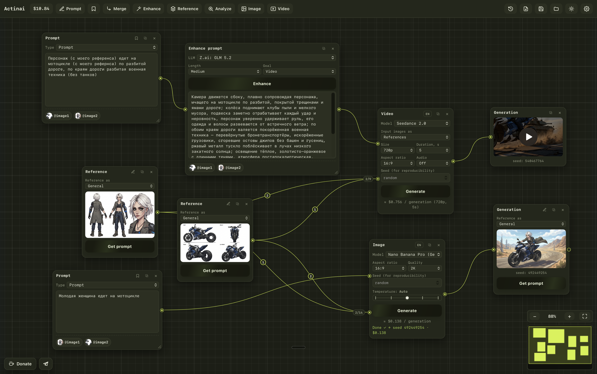

<h1 align="center">Actinai</h1>

<p align="center">
  Интерфейс для генерации изображений и видео через OpenRouter.<br>
  A node-based editor for AI image &amp; video generation, powered by OpenRouter.
</p>

<p align="center">
  <a href="https://github.com/rslkolt/Actinai/releases/latest"></a>
  
</p>

<p align="center">
  
</p>

---

## Русский

**Actinai** — это удобный визуальный интерфейс к [OpenRouter](https://openrouter.ai): вы собираете промпты, референсы, генерацию и результат как узлы (ноды) на холсте. Нативное приложение для macOS и Windows.

> Приложение бесплатное. Генерация платная и идёт через ваш баланс OpenRouter — нужен свой API-ключ (см. ниже).

### Возможности
- Генерация **изображений** и **видео** на одном холсте из узлов.
- Топовые модели через OpenRouter: Nano Banana Pro (Gemini 3 Pro Image), Seedance, Veo и другие.
- Референсы с быстрой вставкой `@image1` в промпт, роли референсов, режим «первый/последний кадр» для видео.
- Сборка и улучшение промптов (LLM), перевод, негативные промпты, стиль-пресеты.
- Инпейнт (правка по маске) и расширение кадра (outpaint), захват кадра из видео.
- История генераций, сохранение проектов на диск, тёмная/светлая тема, RU/EN интерфейс.

### Установка
Скачайте последнюю версию во вкладке [**Releases**](https://github.com/rslkolt/Actinai/releases/latest):
- **macOS, Apple Silicon (M1–M4):** `Actinai_*_aarch64.dmg`
- **macOS, Intel:** `Actinai_*_x64.dmg`
- **Windows:** `Actinai_*_x64-setup.exe`

**macOS:** откройте `.dmg`, перетащите Actinai в «Программы». При первом запуске — правый клик по приложению → «Открыть» → подтвердить. Если пишет «приложение повреждено», выполните в Терминале:
```
xattr -dr com.apple.quarantine /Applications/Actinai.app
```

**Windows:** запустите установщик. Если появится SmartScreen — «Подробнее» → «Выполнить в любом случае».

Предупреждения возникают потому, что сборки не подписаны платным сертификатом — это нормально для бесплатных приложений.

### Ключ OpenRouter
1. Зарегистрируйтесь на [openrouter.ai](https://openrouter.ai) и пополните баланс (**Settings → Credits**).
2. Создайте ключ: [openrouter.ai/keys](https://openrouter.ai/keys) → **Create Key** (`sk-or-...`).
3. В Actinai откройте **Настройки** (⚙) и вставьте ключ. Он хранится локально и отправляется только в OpenRouter.

---

## English

**Actinai** is a friendly visual interface for [OpenRouter](https://openrouter.ai): build prompts, references, generation and results as nodes on a canvas. Native app for macOS and Windows.

> The app is free. Generation is paid and runs through your OpenRouter balance — you need your own API key (see below).

### Features
- Generate **images** and **video** on one node canvas.
- Top models via OpenRouter: Nano Banana Pro (Gemini 3 Pro Image), Seedance, Veo and more.
- References with quick `@image1` insertion into the prompt, reference roles, first/last-frame mode for video.
- Prompt merging & enhancement (LLM), translation, negative prompts, style presets.
- Inpaint (mask editing) and outpaint, grab a frame from video.
- Generation history, save projects to disk, dark/light theme, RU/EN UI.

### Install
Grab the latest build from [**Releases**](https://github.com/rslkolt/Actinai/releases/latest):
- **macOS, Apple Silicon (M1–M4):** `Actinai_*_aarch64.dmg`
- **macOS, Intel:** `Actinai_*_x64.dmg`
- **Windows:** `Actinai_*_x64-setup.exe`

**macOS:** open the `.dmg`, drag Actinai to Applications. First launch — right-click → Open → confirm. If it says "app is damaged", run in Terminal:
```
xattr -dr com.apple.quarantine /Applications/Actinai.app
```

**Windows:** run the installer. If SmartScreen appears → More info → Run anyway.

Warnings appear because the builds aren't signed with a paid certificate — normal for free apps.

### OpenRouter key
1. Sign in at [openrouter.ai](https://openrouter.ai) and add credits (**Settings → Credits**).
2. Create a key at [openrouter.ai/keys](https://openrouter.ai/keys) → **Create Key** (`sk-or-...`).
3. In Actinai open **Settings** (⚙) and paste it. The key is stored locally and only sent to OpenRouter.
